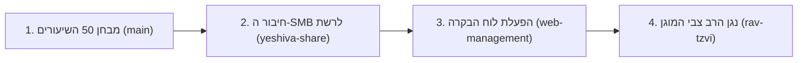

# 🗺️ מפת ענפי הפרויקט ושלבי הפריסה בישיבה (Branches & Roadmap)

מסמך זה מספק תמונת מצב מלאה ומדויקת על כל אחד מ-4 הענפים בפרויקט, תכולתם המדויקת, וסדר הפעולות המומלץ לפריסה בשטח בישיבה.

---

## 📊 טבלת ריכוז הענפים ב-Git

| שם הענף (Branch) | ייעוד מרכזי | מה פותח ונמצא בענף? | סטטוס ומוכנות |
| :--- | :--- | :--- | :--- |
| **`main`** | **מנוע הליבה וכלי בנצ'מרק** | • מנוע תמלול מהיר בדיוק עברי ישיבתי (`ivrit-ai` + Gemma 4)<br>• חילוץ ישויות ושמות רבנים (Few-Shot Prompting)<br>• צריבת תגיות מטא-דאטה ID3 עבריות<br>• שאיבת USB אוטומטית<br>• כלי ניתוח ומדידת ביצועים (`analyze_benchmark.py`) | **מוכן להרצת מבחן 50 השיעורים בישיבה** ✅ |
| **`feature/yeshiva-share-integration`** | **חיבור שרת הקבצים וסנכרון מאובטח** | • סקריפט חיבור ועגינה אוטומטית לשרת ה-Windows (`setup_smb_mount.sh`)<br>• ניתוב ישיר לתיקיית היעד `שיעורי שמע\שיעורים למיון`<br>• שאיבת USB מהירה עם שחרור ומחיקת מקלט מיידית (1-2 שניות)<br>• מנגנון Staging מקומי (Local Buffer) לחוסן מלא מול ניתוקי רשת | **מוכן לבדיקה בעת החיבור לרשת הישיבה** ✅ |
| **`feature/web-management`** | **ממשק ניהול Web ואינטגרציית תלמידים** | • שרת Backend מלא (`FastAPI`) עם הזרמת שמע חכמה ללא שכפול קבצים<br>• לוח בקרה גרפי לאחראי (מוגן סיסמה) עם רשימת רבנים והקלדת רב חדש<br>• תיבת הערות והתראות מרוכזת (Alerts Inbox)<br>• דף השארת הערה מהיר לתלמידים (`/student`)<br>• סקריפט התקנה להוספת "השאר הערה" בלחיצה ימנית בווינדוס (`install.bat`)<br>• כלי אינטראקטיבי להגדרת סיסמת מנהל (`set_admin_password.py`) | **מוכן לפריסה והרצה** ✅ |
| **`feature/rav-tzvi-protected-streaming`** | **האזנה מוגנת לשיעורי הרב צבי** | • ממשק דמוי סייר קבצים של Windows (`/rav-tzvi`) עם ניווט תיקיות וספרים<br>• חיפוש גלובלי מהיר בכל תתי-התיקיות והספרים של הרב צבי<br>• נגן שמע מתקדם עם מהירויות נגינה (`0.5x` עד `2.0x`) וקפיצות של 10 שנ' ודקה<br>• חסימת הורדות, העתקות ושמירת קבצים (Anti-Download Protection)<br>• קיצור דרך מוכן להנחה בשיתוף הקבצים (`🎙️ שיעורי הרב צבי קוסטינר.url`)<br>• סקריפט להרצה ישירה על שרת הווינדוס (`setup_windows_streaming.bat`) | **מוכן לפריסה והרצה** ✅ |

---

## 🎯 סדר הפעולות המומלץ להטמעה בישיבה (צעד-אחר-צעד)



### שלב 1: הרצת מבחן 50 השיעורים על שרת המקלטים (ענף `main`)
1. ודא שאתה על ענף `main`:
   ```bash
   git checkout main
   ```
2. הנח 50 הקלטות שמע מגוונות מכלל רבני הישיבה בתיקיית `data/incoming/`.
3. הרץ סריקה ועיבוד:
   ```bash
   python main.py --scan
   ```
4. הפק דוח ביצועים ודיוק מעמיק:
   ```bash
   python analyze_benchmark.py --export benchmark_report.md
   ```
5. בחן את אחוזי הדיוק, זמני העיבוד, והתפלגות הרבנים שזוהו.

---

### שלב 2: חיבור שרת הקבצים של הישיבה (ענף `feature/yeshiva-share-integration`)
1. עבור לענף הרשת:
   ```bash
   git checkout feature/yeshiva-share-integration
   ```
2. הרץ את סקריפט החיבור והעגינה האוטומטי:
   ```bash
   sudo ./setup_smb_mount.sh
   ```
3. הזן את פרטי משתמש ה-Windows הייעודי לשרת.
4. חבר מקלט לשקע ה-USB וודא שההקלטות נשאבות, נמחקות מהמקלט מיד, ומגיעות ישירות לתיקיית `שיעורים למיון` בשרת ה-Windows.

---

### שלב 3: הפעלת לוח הבקרה והאינטגרציה לתלמידים (ענף `feature/web-management`)
1. עבור לענף ה-Web:
   ```bash
   git checkout feature/web-management
   ```
2. הפעל את שירות ה-systemd או הרץ ישירות:
   ```bash
   python main.py --all
   ```
3. **בדיקת אחראי:** גש מכל דפדפן ברשת לכתובת `http://mdserver:8000/admin` (סיסמה מוגדרת ב-`.env`).
4. **הפצה למחשבי הישיבה:** העתק את התיקייה `client_tools` על גבי DOK והרץ את `install.bat` בכל מחשב ציבורי.

---

### שלב 4: הפעלת ספריית שיעורי הרב צבי המוגנת (ענף `feature/rav-tzvi-protected-streaming`)
1. עבר לענף שיעורי הרב צבי:
   ```bash
   git checkout feature/rav-tzvi-protected-streaming
   ```
2. הנח את קיצור הדרך `client_tools/🎙️ שיעורי הרב צבי קוסטינר.url` בתוך תיקיית `\\mdserver\שיעורי שמע\` לצד שאר תיקיות הרבנים.
3. בשרת ה-Windows, הפעל את שירות ההזרמה המקומי באמצעות:
   ```cmd
   setup_windows_streaming.bat
   ```
4. ודא שתלמידים יכולים להיכנס דרך קיצור הדרך, לחפש שיעורים, לשנות מהירויות נגינה, ולראות שהאפשרות להוריד את הקובץ ל-DOK חסומה לחלוטין.

---

## 🔀 פקודות מעבר מהירות בין ענפים (Cheatsheet)

```bash
# מעבר לענף הבנצ'מרק והמנוע הראשי
git checkout main

# מעבר לענף חיבור שרת ה-Windows ו-Staging
git checkout feature/yeshiva-share-integration

# מעבר לענף ממשק הניהול וההערות
git checkout feature/web-management

# מעבר לענף ספריית הרב צבי המוגנת
git checkout feature/rav-tzvi-protected-streaming

# צפייה בכל הענפים הקיימים
git branch -a
```
