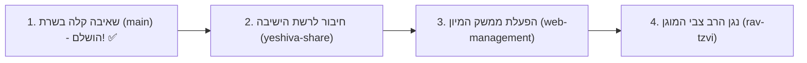

# 🗺️ מפת ענפי הפרויקט ושלבי הפריסה בישיבה (Branches & Roadmap)

מסמך זה מספק תמונת מצב מלאה ומדויקת על כל אחד מהענפים בפרויקט, תכולתם המדויקת, וסדר הפעולות המומלץ לפריסה בשטח בישיבה.

---

## 📊 טבלת ריכוז הענפים ב-Git

| שם הענף (Branch) | ייעוד מרכזי | מה פותח ונמצא בענף? | סטטוס ומוכנות |
| :--- | :--- | :--- | :--- |
| **`main`** | **מנוע שאיבה קל ומהיר (Lightweight Ingestion)** | • שאיבת USB אוטומטית ממקלטים ודיסק-און-קי<br>• אימות Checksum SHA-256 ומחיקה בטוחה מהמקלט<br>• חילוץ תאריכי הקלטה והמרה לתאריך עברי אותנטי<br>• העברה מהירה (0.1 שנ') לתור המיון ללא עומס משאבים<br>• שירות רקע `systemd` פעיל ויציב בשרת | **פעיל ובדוק בהצלחה על מקלטי אמת בשרת** ✅ |
| **`feature/ai-integration`** | **מנוע AI ותמלול מקומי (שמור להמשך)** | • מנוע תמלול עברי `ivrit-ai/whisper-large-v3-turbo-ct2`<br>• חיתוך אקוסטי דינמי עם Silero VAD<br>• חילוץ ישויות עם מודלי שפה מקומיים ב-Ollama ו-JSON Schema<br>• כלי ניתוח דוחות ביצועים (`analyze_benchmark.py`) | **שמור לפיתוח והעמקה עתידיים** 📦 |
| **`feature/yeshiva-share-integration`** | **חיבור שרת הקבצים וסנכרון מאובטח** | • סקריפט חיבור ועגינה אוטומטית לשרת ה-Windows (`setup_smb_mount.sh`)<br>• ניתוב ישיר לתיקיית היעד `שיעורי שמע\שיעורים למיון`<br>• מנגנון Staging מקומי לחוסן מלא מול ניתוקי רשת | **מוכן לחיבור לשיתוף הרשת של הישיבה** 🌐 |
| **`feature/web-management`** | **ממשק ניהול Web ואינטגרציית תלמידים** | • שרת Backend מלא (`FastAPI`) עם נגן שמע מובנה<br>• לוח בקרה גרפי לאחראי לסיווג מהיר של שיעורים מתוך תור המיון<br>• העברה אוטומטית לתיקיות הרבנים והספרים לפי מיפוי הישיבה<br>• תיבת הערות והתראות מרוכזת (Alerts Inbox) ודף תלמידים (`/student`) | **מוכן לפריסה וסיווג ידני מהיר** 🖥️ |
| **`feature/rav-tzvi-protected-streaming`** | **האזנה מוגנת לשיעורי הרב צבי** | • ממשק דמוי סייר קבצים של Windows (`/rav-tzvi`) עם ניווט תיקיות וספרים<br>• חיפוש גלובלי מהיר בכל תתי-התיקיות והספרים של הרב צבי<br>• נגן שמע מתקדם עם שינוי מהירויות נגינה (`0.5x` עד `2.0x`)<br>• חסימת הורדות, העתקות ושמירת קבצים (Anti-Download Protection) | **מוכן לפריסה והרצה** 🔒 |

---

## 🎯 סדר הפעולות המומלץ להמשך



---

## 🔀 פקודות מעבר מהירות בין ענפים (Cheatsheet)

```bash
# מעבר לענף השאיבה הראשי (Lightweight Ingestion)
git checkout main

# מעבר לענף מנוע ה-AI השמור
git checkout feature/ai-integration

# מעבר לענף חיבור שרת ה-Windows ו-SMB
git checkout feature/yeshiva-share-integration

# מעבר לענף ממשק הניהול והמיון הידני
git checkout feature/web-management

# מעבר לענף ספריית הרב צבי המוגנת
git checkout feature/rav-tzvi-protected-streaming
```
